# OrcaDetector Final Project Report

This UC Berkeley Master of Information in Data Science final course project was developed by
[Spyros Garyfallos](mailto:spiros.garifallos@berkeley.edu ), [Ram Iyer](mailto:ram.iyer@berkeley.edu), and [Mike Winton](mailto:mwinton@berkeley.edu) for the W251 "Deep Learning in the Cloud and at the Edge" course (Summer 2019 term).

## Abstract

This paper applies the previously published [VGGish audio classification model](https://ai.google/research/pubs/pub45611) to classify the species of marine mammals based on audio samples.  We use a distant learning approach, beginning with model weights that were pretrained on Google's published [Audioset](https://research.google.com/audioset/) data.  We then finish training with a strongly supervised dataset from [Watkins Marine Mammal Sound Database](https://cis.whoi.edu/science/B/whalesounds/fullCuts.cfm).  We achieve an overall F1 score of 0.89 over 38 species, with 26 of the species achieving an F1 score >= 0.70.  We then deploy the trained model to an [NVIDIA Jetson TX2](https://www.nvidia.com/en-us/autonomous-machines/embedded-systems/jetson-tx2/) edge computing device to perform inference locally, simulating a deployment connected to a hydrophone in the middle of the ocean without internet connectivity.   Since we don't have access to our own hydrophone, for the purposes of simulation, we connect to the [live.orcasound.net](http://live.orcasound.net) live audio stream and perform inference on this stream.  We also incorporate the ability for a person to "inject" an audio sample from a marine mammal species into the live audio stream to simulate an actual detection event via our interative notebook.

## Introduction

### Marine Mammals

Marine mammals rely on the ocean and other marine ecosystems for their existence. They include animals such as seals, whales, manatees, sea otters and polar bears, and are unified by their reliance on the marine environment for feeding [[Wikipedia](https://en.wikipedia.org/wiki/Marine_mammal)].

### Killer Whale

Source: [Wikipedia](https://en.wikipedia.org/wiki/Killer_whale)

The Killer Whale, or Orca, is a toothed whale that is the largest member of the oceanic dolphin family. Some feed exclusively on fish, while others hunt marine mammals such as seals and other dolphins. They have even been known to attack whales. Killer whales are at the top of the food chain in the ocean, as no animal preys on them, and they can be found in all of the world's oceans,absent only from the Baltic and Black seas, as well as some areas of the Arctic Ocean [[Wikipedia](https://en.wikipedia.org/wiki/Killer_whale)].

### Killer Whale Types

Research off the west coast of Canada and the United States in the 1970s and 1980s identified the following three types [[Wikia.org](https://psychology.wikia.org/wiki/Killer_whales)]:

1. **Resident**: These are the most commonly sighted of the three populations in the coastal waters of the northeast Pacific.

1. **Transient**: The diets of these whales consist almost exclusively of marine mammals.

1. **Offshore**: A third population of killer whales in the northeast Pacific was discovered in 1988, when a humpback whale researcher observed them in open water.

Examples of their geographic ranges:

Source: [Scientific Reports](https://www.nature.com/articles/s41598-019-47335-w)

### Echolocation

Sound waves travel through water at a speed of about 1.5 km/sec (0.9 mi/sec), which is 4.5 times as fast as sound traveling through air. Marine mammals have developed adaptations to ensure effective communication, prey capture, and predator detection. Probably one of the most important adaptations is the development of echolocation in whales and dolphins [[Wikipedia](https://en.wikipedia.org/wiki/Animal_echolocation)].

Source: [Wikipedia](https://en.wikipedia.org/wiki/Animal_echolocation)

Killer whales are believed to rely use echolocation to navigate, communicate, and hunt in dark or murky waters [[Seaworld.org](https://seaworld.org/animals/all-about/killer-whale/communication/)].

Source: [Wikipedia](https://en.wikipedia.org/wiki/Animal_echolocation)

### Communication

Killer whales make a variety of different noises. They use whistles for close-range communication; the frequency of killer whale whistles ranges from about 0.5 to 40 kHz, with peak energy at 6 to 12 kHz. However, pulsed calls are their most common vocalization  [[Seaworld.org](https://seaworld.org/animals/all-about/killer-whale/communication/)].

Source: [Seaworld.org](https://seaworld.org/animals/all-about/killer-whale/communication/)

The individuals of any particular pod share the same repertoire of calls, a vocalization system called a dialect, which is unique to that pod. Analysis of killer whale call patterns has demonstrated substantial differences between the dialects of different pods. Pods that associate with one another may share certain calls, but no two pods share the entire repertoire [[Seaworld.org](https://seaworld.org/animals/all-about/killer-whale/communication/)].

### Audio samples

There are multiple samples online of different Killer Whale sounds. Here, we've assembled a few of them that we think are interesting:

1. [Resident calls](http://www.marinemammal.org//wp-content/uploads/2012/10/Resident_calls1.wav)

1. [Transient whistles](http://www.marinemammal.org//wp-content/uploads/2012/10/Transient_whistles2.wav)

1. [Transient calls](http://www.marinemammal.org//wp-content/uploads/2012/10/Transient_calls.wav)

1. [Transient echolocation](http://www.marinemammal.org//wp-content/uploads/2012/10/Transient_echolocation1.wav)

### Echolocation samples slowed down

Here, we can hear the clicks echoing back on underwater surfaces by slowing down the audio speed by a factor of 10x:

1. [South Residents Killer Whale clicks normal speed](https://www.orcasound.net/data/processed/SRKW/orcasite/srkw-clicks-slow.mp3)

1. [South Residents Killer Whale clicks slowed down 10x](https://www.orcasound.net/data/processed/SRKW/orcasite/srkw-clicks-slowed10x.mp3)

### Underwater noise

Underwater noise from shipping, drilling, and other human activities is a significant concern in some Killer Whale habitats, including Johnstone Strait and Haro Strait. In the mid-1990s, loud underwater noises from salmon farms were used to deter seals. Killer whales also avoided the surrounding waters [[Seattle Times](https://projects.seattletimes.com/2019/hostile-waters-orcas-noise/)]. High-intensity sonar used by the Navy also disturbs Killer Whales and other marine mammals [[Scientific American](https://www.scientificamerican.com/article/does-military-sonar-kill/)].  Killer Whales are also extremely popular with whale watchers, whose ships may stress the whales and alter their behaviour if boats approach too closely or block their lines of travel.

### OrcaSound Lab

Because it's within the summertime habitat of the endangered southern resident Killer Whales, [Orcasound Lab](https://www.orcasound.net/portfolio/orcasound-lab-hydrophone/) is a good location for a hydrophone to listen for Killer Whales.  On their live stream, one can also hear ships passing by.  At other times of year, it's possible to hear Humpback Whales (fall) and Harbor Seals (summer). According to their site, hydrophones were first deployed in 2002 are currently just beyond the kelp about 30 m offshore at a depth of 8 m. 

### OrcaSound Lab Hydrophones

Here we see an image of one of their first generation hydrophones from the [Orcasound Lab](https://www.orcasound.net/portfolio/orcasound-lab-hydrophone/) website.  It is connected to an array of hydrophones stretched for ~200 m along the shore at depths of 5-20 meters.

Source: [OrcaSound](https://www.orcasound.net/portfolio/orcasound-lab-hydrophone/)

And here's a view of their second generation hydrophone, based on a Raspberry Pi 3 in a waterproof box.  according to their website, it is using ffmpeg (as do we), and storing data on AWS.

Source: [OrcaSound](https://www.orcasound.net/2018/04/27/orcasounds-new-live-audio-solution-from-hydrophone-to-headphone-with-a-raspberry-pi-computer-and-hls-dash-streaming-software/)

### Automating Detection on the Edge

In the research community there seems to be tremendous desire for an accurate, automated detection system that could process live streams from such hydrophones. Although attempts have been made to create one, today most of the detections seem to be made by people listening to the audio, live or recorded, either experts or self-taught community enthusiasts.  Our project is developed in response to this need.

An accurate detection mechanism will allow the marine scientists to collect more samples and better understand these species.  A real time accurate detector could also produce a timely warning to vessels in the proximity of the detection to reduce speed or pause extreme activities like submarine military sonar exercises, in order to protect the marine mammals and offer a safe passage.

Additionally, because the required upstream bandwidth and cost for streaming and recording all audio from such hydrophones is prohibitive, there would be enormous value in having an automated detector which could run at the edge and upload only the (realtively rare) positive samples.

## Background for Audio Classification

### Representing Audio Signals

Audio signals are typically represented by a 1D vector comprising of a time series of signal amplitudes. The translation of the analog audio signal to the 1D vector is done using [Pulse Code Modulation](https://en.wikipedia.org/wiki/Pulse-code_modulation). Two parameters of importance during the PCM process are the bit-depth and the sampling rate.

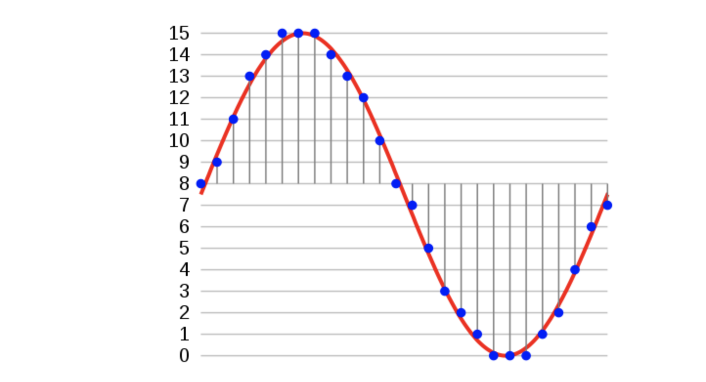

Source: [*kaggle Beginner Guide to Audio*](https://www.kaggle.com/fizzbuzz/beginner-s-guide-to-audio-data)

- **Bit Depth** - Range of amplitude values that can be represented. For example a 16 bit bit depth implies that 2^16 (=65536) different values can be represented
- **Sampling Rate** - Number of times the audio is sampled per second. A sampling rate of 44.1KHz implies that 44100 samples of the audio amplitude are recorded per second.

So, for a 16bit depth audio, recorded at 44.1KHz for 4 seconds would comprise of 44,100 * 4 = 176,400 numbers, each with 2 bytes, implying approximately 352 kB of data.

### Audio Features for Machine Learning

Machine Learning techniques have been successfully employed for classifying audio signals. One approach is to directly use a Logistic Regression or a ConvNet model directly on the 1D vector representing the audio signal. However, this approach does not take into account the human perception of audio or the time series aspects of an audio signal. More refined techniques work on a window around the audio signal and do feature extraction in the frequency domain in order to generate a more robust set of features for the machine learning models to work with.

### Mel Spectrogram

Mel Frequency Cepstral Coefficents (MFCCs) are a feature widely used in automatic speech and speaker recognition. They were introduced by Davis and Mermelstein in the 1980's, and have been state-of-the-art ever since.
The Mel Spectrogram attempts to model the characteristics of the human ear. It is observed that the human ear acts as a filter and concentrates only on certain frequency components and also gives more importance to lower frequency components as compared to higher frequency components. The Mel Spectrogram is constructed using Filter Banks each of which focus on a selected frequency range. The Image below shows an illustration of the Filter Banks.

Source: [*Aalto University Wiki*](https://wiki.aalto.fi/display/ITSP/Cepstrum+and+MFCC)

Each of the filters focus on a frequency range. As can be seen the filters are more concentrated in the lower frequency range and get sparse at the higher frequency range.

The flow used to convert the audio signal to the Mel Spectrogram is illustrated below. More details of the process can be found in this [excellent tutorial](https://archive.org/details/SpectrogramCepstrumAndMel-frequency_636522) from CMU.

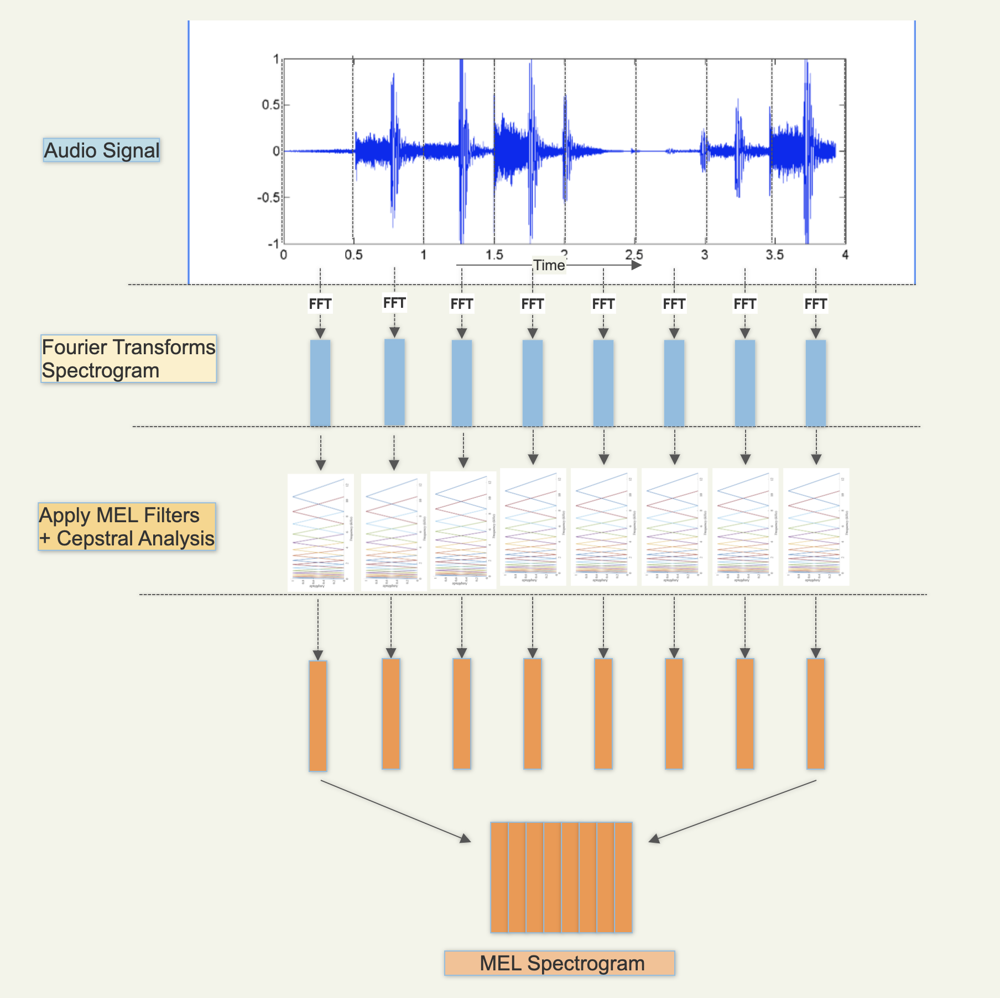
[*Adapted from CMU slides*](https://archive.org/details/SpectrogramCepstrumAndMel-frequency_636522)

The below diagrams illustrate the audio signal and their Mel spectrogram for some samples from our dataset

#### Killer Whale - Sample Audio/Mel Features

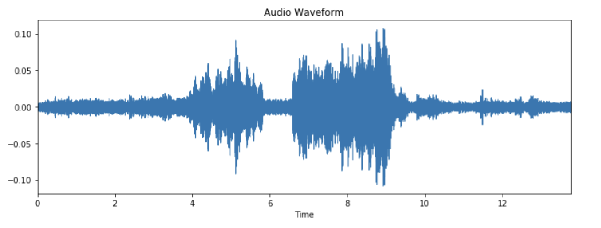

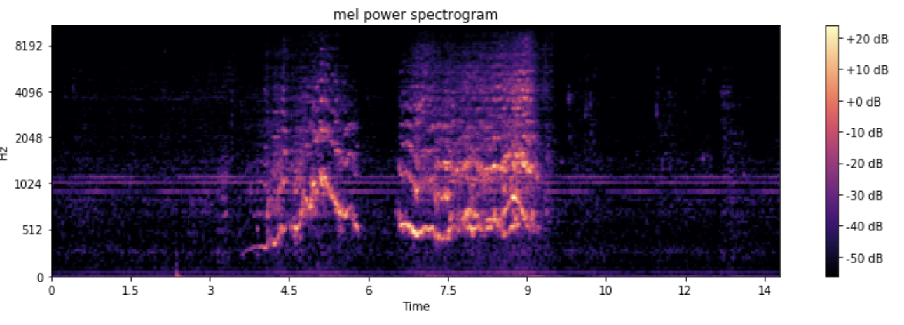

#### Humpback Whale - Sample Audio/Mel Features

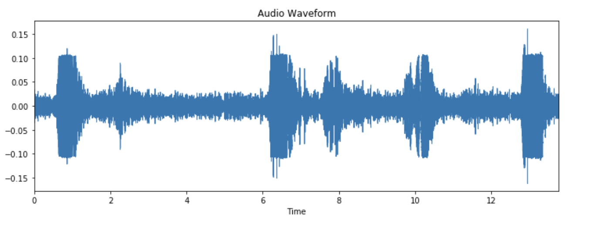

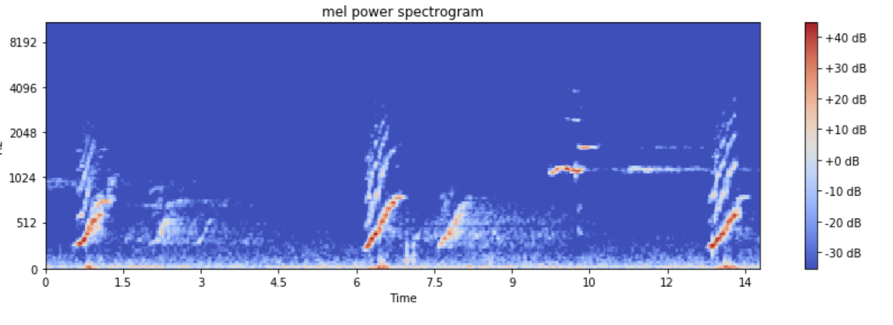

## Current Contributions

Mel spectrograms are commonly used representations of audio signals, as they are more classifiable by deep learning models than the original audio waveforms.  They have been used as a feature representation in deep learning models for the classification of whale acoustic signals, and also for automated classification of bird species.  However, we believe our work is unique in that we simultaneously attempt to classify a large number of marine mammal species (38), generally with very good results.

We also have collected "noise" data from multiple live streaming hydrophones in different locations in order to create a supervised "Noise" training set.  This is important in that it can be used in combination with the actual marine mammal training data to enable the model to predict when _none of the species_ are present in a given audio sample.  This is important for real-life applications, as we would generally expect a hydrophone to not be picking up marine mammal audio most of the time.

We also demonstrate that our model, once trained on a cloud virtual machine can then be deployed to a disconnected edge computing device for inference (the TX2).  When a positive prediction is made, we also capture the audio signal, which could enable further future analysis.

## Model Architecture

We use a model architecture named "[VGGish](https://github.com/tensorflow/models/tree/master/research/audioset/vggish)", developed by Google, along with pretrained weights trained on a subset of Google's AudioSet with 2 million human-labeled 10-second YouTube video clips, with labels taken from an ontology of more than 600 audio event classes.  This model gets its name from the fact that it's based on the common [VGG](https://arxiv.org/abs/1409.1556) architecture for image classification.

After instantiating the model with Google's pretrained weights, we apply a distant supervision approach by treating those weights as a "warm start" for a model with additional layers built on top of the original VGGish layers.  We also continue to update the weights in the core VGGish layers when we train on our supervised marine mammal training set.

Specifically VGGish is a variant of the 11 weight-layer version of VGG (model "A" in the original paper), with the following changes:

1. Input size was changed to 96x64 for consistency with log Mel spectrogram inputs.
2. The last group of convolutional and max pool layers are dropped, leaving this model with only 4 groups instead of 5 in the original model.
3. The final 1000-wide fully-connected layer is replaced with a 128-wide fully-connected layer.  (Note that the model we developed and trained does not incorporate this layer; we only use the pre-bottleneck layers of VGGish.)

On top of those base layers, we have added a dropout layer to provide some regularization before the final max pooling layer.  Then we add a series of two 256-wide fully-connected layers, and the final 38-class softmax layer.  Our complete model is shown below:

We use categorical cross-entropy as our loss function, and the Adam optimizer.

## Method

Most of our development and model training was done on virtual machines with NVIDIA V100 GPUs.  Our choice to use Docker containers enabled us to use both IBM Virtual Servers (e.g. ACL2.8x60x100 instances with 8 VPUs, 1 V100 GPU w/ 16GB GPU memory, and 60 GB RAM) as well as AWS instances (e.g. p3.2xlarge instances with 8 VCPUs, 1 V100 GPU w/ 16GB GPU memory, 61 GB RAM).  Once we had trained weights, we deployed to NVIDIA Jetson TX2 developer boards.  We implement our model in Keras, bootstrapping with substantial code from [Google's VGGish repo](https://github.com/tensorflow/models/tree/master/research/audioset/vggish) and [DTaoo's Keras implementation](https://github.com/DTaoo/VGGish).

> **See [setup.md](setup.md) for technical details on training a model and running inference with it.**

### Dataset

To train a multi-class DNN we used the [Watkins Marine Mammal Sound Database](https://cis.whoi.edu/science/B/whalesounds/index.cfm). We contacted the Watkins scientific team and got  the permission to crawl their online database.

#### Web Scraping

Furthermore, the team provided us with a web crawling prototype implemented in Python to facilitate our efforts. A modified version of it is committed in this repo. The crawled dataset consisted of ~20 GB of labeled WAV files from 56 different marine mammals. These samples have been collected from different locations and years.

> We've excluded all species from the dataset that had too few audio segments to effectively train on.

#### Mel Spectrogram Feature Computation

We compute our audio features consistently with Google (using open source code provided in their [GitHub repo](https://github.com/tensorflow/models/tree/master/research/audioset/vggish)):

1. We resample all audio files (up or down-sampling as necessary) to 16 KHz.
2. We compute a spectrogram using magnitudes of a Short-Time Fourier Transform with 25 ms window size, 10 ms window hop, and a periodic Hann window.
3. We compute a Mel spectrogram by mapping this spectrogram to 64 mel bins, covering 125-7500 Hz.
4. We calculate a stabilized log Mel spectrogram as log(Mel spectrogram + 0.01) in order to errors from log(0).
5. We quantize the spectrogram into non-overlapping segments of 0.96 seconds length, corresponding to 64 mel bands x 96 frames of 10 ms each.

Because the marine mammal audio samples we use for training the model are collected on different equipment in different locations over a span of many years, the recording conditions vary substantially.  As a result, we find it important to apply batch normalization to all data before feeding it in to our neural network.

#### Background Noise Class

To allow the network to detect a negative class (no species detected) we collected and added in the dataset a new class that represented the hydrophone background noise. To do this, we created a noise collection command that run for the duration of a weekend and periodically collected background noise samples from the OrcaSound live feed hydrophones, to make sure that we had a plethora of recorded different background noise phenomena (different ships, speed boats, waves, weather etc.).

#### Stratified Train / Val / Test Datasets

We stratified the remaining samples into three datasets in order that each species would be present in approximately the same proportions in each:

1. 70% for training
2. 20% for validation
3. 10% for test

### Exploratory Data Analysis

A more complete version of our EDDA can be found in [our EDA notebook](orca-eda.ipynb).

The audio samples in the dataset are not evenly distributed among the different species. The plot below shows the distribution of the number of audio files obtained per species.

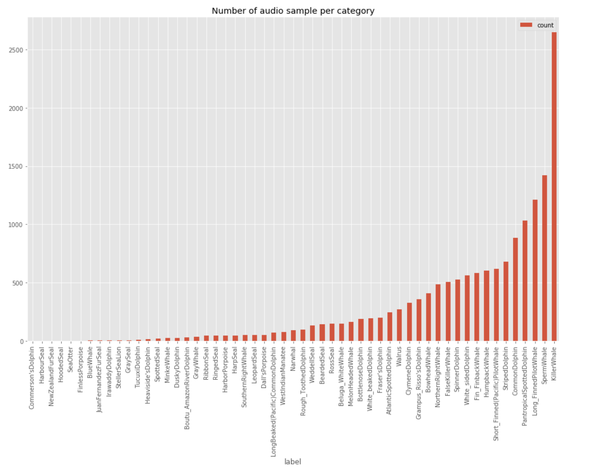

As can be seen the Killer Whale and Sperm Whale species have the largest number of overall files.  The long left tail in this distribution demonstrates why it was necessary to remove some species from our dataset. We list the included samples in the next section.

It's important to note that files were not of consistent lengths.  92% of all the audio samples are less than 10 seconds long, and 85% of all the samples are 5 seconds or below in duration.

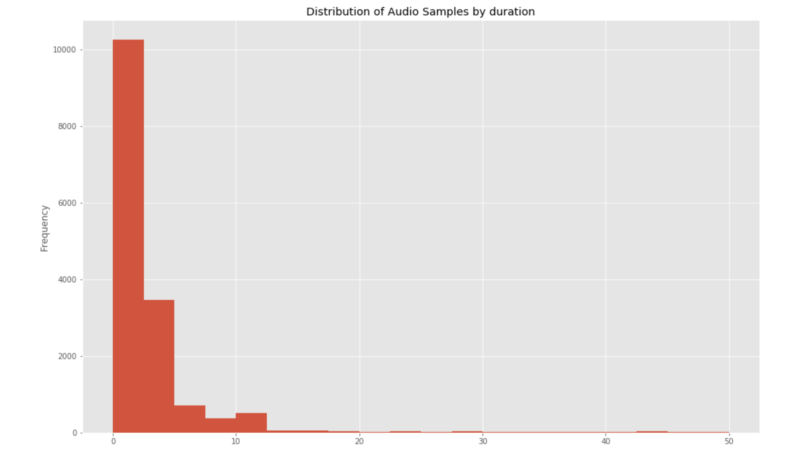

To have a uniform sample duration for use in training and inference, we derive quantized samples of fixed size audio files of slightly less than 1 second in duration. For example given a 5 second original audio sample, 5 quantized samples with the same training label were created.  After the quantization process, the Sperm Whale species dominated the number of samples and ended up being our dominant class.

Since the audio data were recorded over a period of several years and across different geographies and equipment, there is a large variety of sampling rates employed. The plot below shows the distribution of sampling rates used.

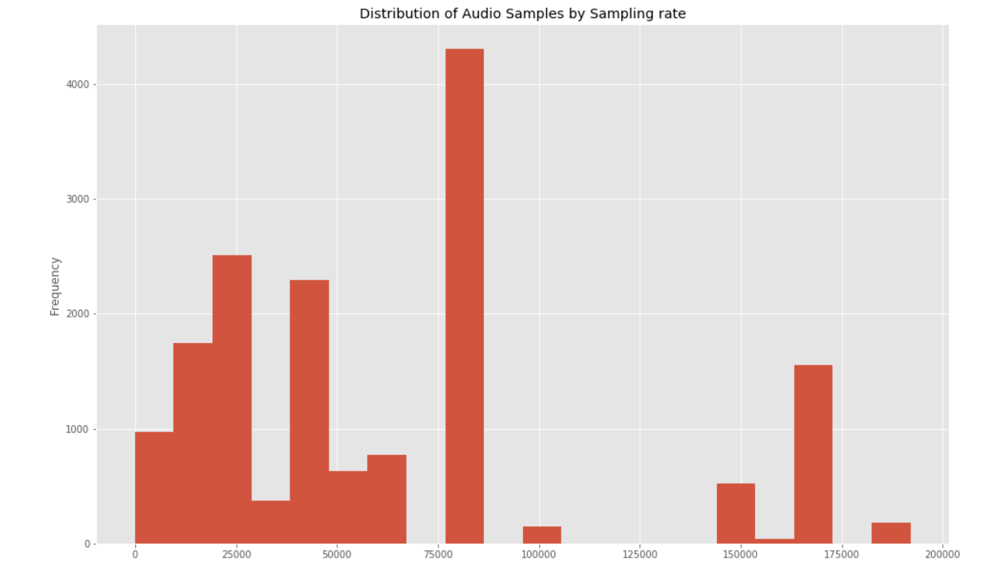

For our Mel feature extraction, we resample the audio at a fixed rate of 16 kHz for a consistent treatment across the audio samples.

#### Modeled species

Based on the number of samples in the training dataset, our final model includes the following species:

- Atlantic Spotted Dolphin
- Bearded Seal
- Beluga White Whale
- Bottlenose Dolphin
- Boutu Amazon River Dolphin
- Bowhead Whale
- Clymene Dolphin
- Common Dolphin
- Dall's Porpoise
- Dusky Dolphin
- False Killer Whale
- Fin Finback Whale
- Frasers Dolphin
- Grampus Risso's Dolphin
- Gray Whale
- Harbor Porpoise
- Harp Seal
- Humpback Whale
- Killer Whale
- Leopard Seal
- Long Beaked Pacific Common Dolphin
- Long Finned Pilot Whale
- Melon Headed Whale
- Narwhal
- Noise
- Northern Right Whale
- Pantropical Spotted Dolphin
- Ross Seal
- Rough Toothed Dolphin
- Short Finned Pacific Pilot Whale
- Southern Right Whale
- Sperm Whale
- Spinner Dolphin
- Striped Dolphin
- Walrus
- Weddell Seal
- West Indian Manatee
- White Baked Dolphin
- White Sided Dolphin

The model excludes the following:

- Blue Whale
- Commerson's Dolphin
- Finless Porpoise
- Gray Seal
- Harbour Seal
- Heaviside's Dolphin
- Hooded Seal
- Irvaddy Dolphin
- Juan Fernandez Fur Seal
- Minke Whale
- New Zealand Fur Seal
- Ribbon Seal
- Ringed Seal
- Sea Otter
- Spotted Seal
- Steller Sea Lion
- Tucuxi Dolphin

### Experimental Results

We performed a series of hyperparameter optimization experiments varying the following parameters in the specified ranges (details of key runs are in this [Google Sheet](https://docs.google.com/spreadsheets/d/1AInfJPV6c3MjMXjJ0WYBfp52MPZmGdZVDw-sr4wghvg/edit?usp=sharing)):

- Batch size: 64 - 256
- Dropout: 0 - 0.4
- Optimizer: Stochastic Gradient Descent, ADAM
- ADAM learning rate: 0.0001 - 0.005
- Final dense layers: None, 2 x 256-wide, 2 x 4096-wide
- L2 regularization: None, 0.005 - 0.1

Our final hyperparameter selection uses a batch size of 64 samples.  We specify 100 epochs of training, with an early stopping condition that typically results in training being completed in approximately 35 epochs. We use an Adam optimizer, with initial learning rate of 0.001.  We also apply a Keras callback to reduce the learning rate when learning has plateaued for 2 consecutive epochs, with a minimum allowed learning rate of 0.00001.

We also apply a dropout of 0.4 after the core VGGish portion of the model, and we apply L2 regularization (lambda=0.01) for all convolutional and fully-connected layers.

Our final model achieved a training loss of 0.4166, a training accuracy of 0.9241; validation set loss of 0.7256, and validation set accuracy of 0.8188. 

> NOTE: if we exclude a few additional species that are hard to classify, we were possible to obtain higher results.  However, we ultimately left those few species in the model as we didn't feel we had an justifiable rationale to remove them.

Here is the validation accuracy for training of our best model:

Here is the corresponding loss plot for training of the best model:

Here we show the classification metrics for the test set, for each species (note that "Support" indicates the number of samples in the test set):

You can observe that most of the species for which we observed low F1 scores in the test set have a relatively small number of samples (see the "Support" column above).  Only the Short Finned Pacific Pilot Whale has a sufficiently large number of samples but still is hard to classify.  It shows high precision, but poor recall.  Further research would be needed in order to better understand why this species is hard to classify.

## Live Stream Inference

After training and testing the network, the next step was real input testing. Of course, this posed two problems:

1. We didn't have a hydrophone, water proof equipment and site with electricity and network coverage to run our model
2. Orca Whales vocalizations nowadays are very rare in the ‎Salish Sea (Seattle greater area)

To mitigate the first problem, we used the live web audio hydrophone sources from [live.orcasound.net](http://live.orcasound.net). There are currently three active hydrophones in the Salish sea, one at the **Port Townsend**, one at the **Bush Point** and finally one at the **Haro Strait**

These live hydrophone sources are broadcasted online using the [HTTP Live Streaming](https://en.wikipedia.org/wiki/HTTP_Live_Streaming) protocol. The live inference program will connect to the configured live streaming endpoints and will collect ten seconds of each stream, in one second segments. Then, after extracting the audio features the same way the features were extracted in the training phase, a batch inference is performed in Keras. If a positive detection is found with a confidence above the minimum threshold (>75%), then a backup of the audio samples is kept along with the inference results in a json file.  This higher threshold is used to avoid filling our hard drive with false positive detections.

To mitigate the sparsity of Orca (and other species') vocalizations, we added to our inference code an ad-hoc mixing capability that injected a predefined Orca sound into the live hydrophones stream. We have found this approach very useful as a testing pipeline that validates a positive detection inference on a known positive sample, and conversely, a negative detection on noise samples. This approach can be very useful in continuous delivery pipelines of newly trained networks, especially for edge-computing scenarios.

## Simulation

We developed an interactive simulation tool based on the Jupyter notebook [ipyWidgets module](https://ipywidgets.readthedocs.io/en/latest/). With this simulation tool the user can select different species from our dataset and listen to an sample audio and view the associated waveform and Mel Spectrogram. In addition they can also select the live audio stream from one of the three hydrophones and mix it with the audio of the mammals and hear/visualize the mixed audio.

Finally, the user can run the inference on the mixed audio to simulate the detection of the presence of a mammal in the audio stream. They can also adjust the volume of each of the audio sources and see the impact on the mixed audio spectrogram as well as the impact to the inference results. As can be expected increasing the live audio stream volume typically just increases the background noise and decreases the prediction accuracy.

While mixing the live audio we use a fixed window of 10 seconds. Since our quantization threshold for the audio samples during training is close to 1 second we create 10 quantized mixed audio samples for inference. As a result the user can potentially see up-to 10 inference results per inference window. The species detected with highest probability among the 10 different quantized samples is reported as the final result of inference.

Below we illustrate the different features of the interface:

1. Select Species, Adjust volume if needed and play audio.

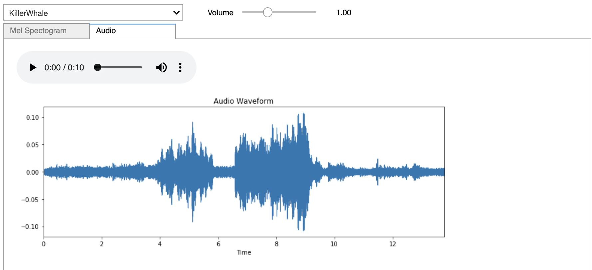

2. View a Mel Spectrogram of selected audio sample.

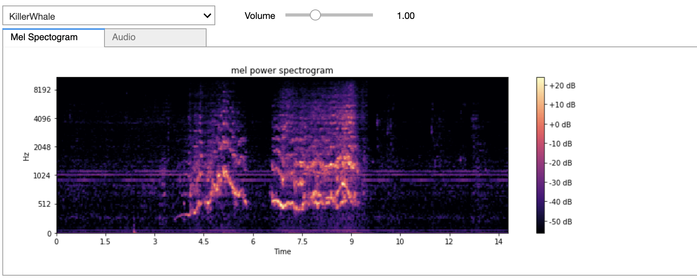

3. Select a live audio stream source, adjust volume if needed, and view details.

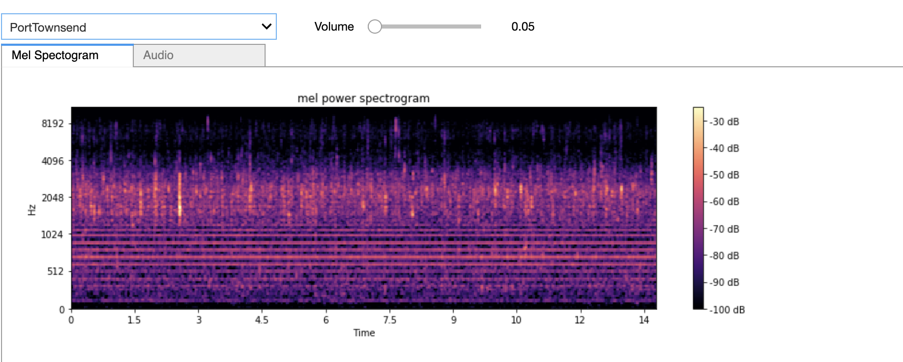

4. Perform inference using our best model.

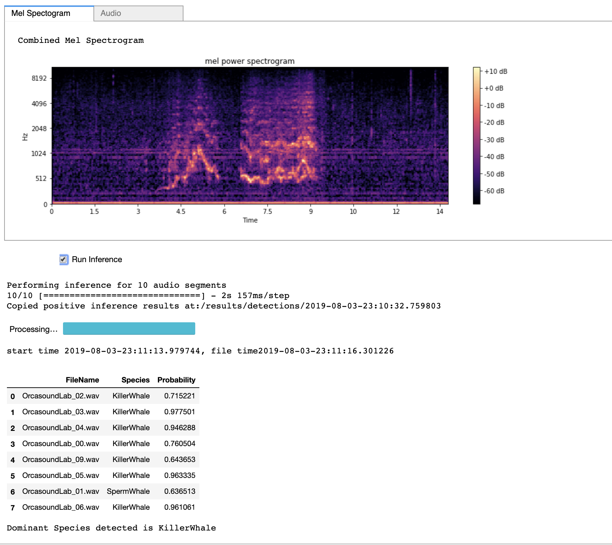

Our interactive simulation is in a companion [Jupyter notebook](orca_detect_demo.ipynb).

## Conclusion

We have successfully trained a multi-class supervised machine learning model based on Google's VGGish architecture to classify 38 species of marine mammals based on audio samples, demonstraing the model's applicability for this marine biology use case.  We used a distant learning approach, loading weights pretrained on 2M samples from Google's Audioset, followed by further training using a labeled dataset from the Watkins Marine Mammal Sound Database.  We achieved an overall F1 score of 0.89, and an impressive F1 of 0.94 for our project's namesake, the Killer Whale.  In total 26 of the species achieved an F1 score >= 0.70 against our test set.  We successfully deployed our trained model to an NVIDIA TX2 device (as well as to cloud VMs) in order to perform inference against a live stream.  We also developed a tool to simulate the presence of a marine mammal over a noisy background.  We believe this model holds potential to be a useful tool to marine biologists, and that there is room to continue to improve its performance.

## Future Work

After talking to some marine mammals experts in the scientific community, there are some valuable low-hanging-fruits as next steps that could put this work into use and provide another tool to the scientific community to help protect and study these species:

- Move the inference onto the existing devices connected to hydrophones. As we saw, the current hydrophones run on a Raspberry Pi 3. Moving the inference onto this device, or perhaps by using an [Edge TPU accelerator](https://coral.withgoogle.com/products/accelerator/), we could enable the collection of high sample-rate, loss-less audio samples of Orcas by uploading only the detection segments. Also, we could enable disconnected hydrophones to record the detections on a limited size memory chip.
- Create location specific training datasets that include samples of a single pod dialect and ambient noise.
- Augment our training dataset by mixing noise with the existing positive samples at various levels (analogous to augmenting image training data by adding blur)
- Improve the live inference sampling method to reduce the 10 seconds sampling window and get closer to zero latency inference.
- Define a manual validation web interface that allows experts to visualize and validate or correct the trained network and increase the quality of the detections.
- Implement a continuous learning pipeline that incorporates the new detections in the training dataset to increase the network accuracy.
- Expand the dataset to more species and collect more data for the species for which data is currently sparse.  Notably we currently have insufficient data to classify most seal species effectively.
- Try downsampling the predominant species (Sperm Whale) during training so that its frequency in the dataset is more similar to other species
- Implement a notification mechanism to inform the community for the real time detection.
- Use the signal from multiple hydrophones to triangulate the location of a pod.
- Use autonomous drones for aerial visual validation of a pod.

## Additional References

- [Marine mammal](https://en.wikipedia.org/wiki/Marine_mammal)
- [Killer Whales Communication and Echolocation](https://seaworld.org/animals/all-about/killer-whale/communication/)
- [Animal echolocation](https://en.wikipedia.org/wiki/Animal_echolocation)
- [Killer Whale](https://en.wikipedia.org/wiki/Killer_whale)
- [An Automatic Killer Whale Sound Detection Toolkit Using Deep Learning](https://www.nature.com/articles/s41598-019-47335-w/figures/1)
- [OrcaSound](https://www.orcasound.net/)
- [OrcaSound Hydrophone 2.0](https://www.orcasound.net/2018/04/27/orcasounds-new-live-audio-solution-from-hydrophone-to-headphone-with-a-raspberry-pi-computer-and-hls-dash-streaming-software/)
- [CNN Architectures for Large-Scale Audio Classification](https://ai.google/research/pubs/pub45611)
- [Audio Set: An ontology and human-labeled dataset for audio events](https://ai.google/research/pubs/pub45857)
- [Very Deep Convolutional Networks for Large-Scale Image Recognition](https://arxiv.org/abs/1409.1556)
- [Fusing Shallow and Deep Learning for Bioacoustic Bird Species Classification](https://par.nsf.gov/servlets/purl/10042567)
- [Detection and Classification of Whale Acoustic Signals](https://pdfs.semanticscholar.org/7707/161301fa094c379a87383dd05058e32fe5cc.pdf)
- [Audio features for web-based ML](https://smus.com/web-audio-ml-features/)
- [Urban Sound Classification using Convolutional Neural Networks with Keras: Theory and Implementation](https://medium.com/gradientcrescent/urban-sound-classification-using-convolutional-neural-networks-with-keras-theory-and-486e92785df4)
- [Audio Classification with Pre-trained VGG-19 (Keras)](https://towardsdatascience.com/audio-classification-with-pre-trained-vgg-19-keras-bca55c2a0efe)
- [BirdNET: the Easiest Way To Identify Birds By Sound](https://birdnet.cornell.edu/)
- [Building a Dead Simple Speech Recognition Engine using ConvNet in Keras](https://blog.manash.me/building-a-dead-simple-word-recognition-engine-using-convnet-in-keras-25e72c19c12b?gi=8dc01998d177)
- [Sound Classification with TensorFlow](https://medium.com/iotforall/sound-classification-with-tensorflow-8209bdb03dfb)
- [Spectrogram, Cepstrum and Mel-Frequency](https://archive.org/details/SpectrogramCepstrumAndMel-frequency_636522)
