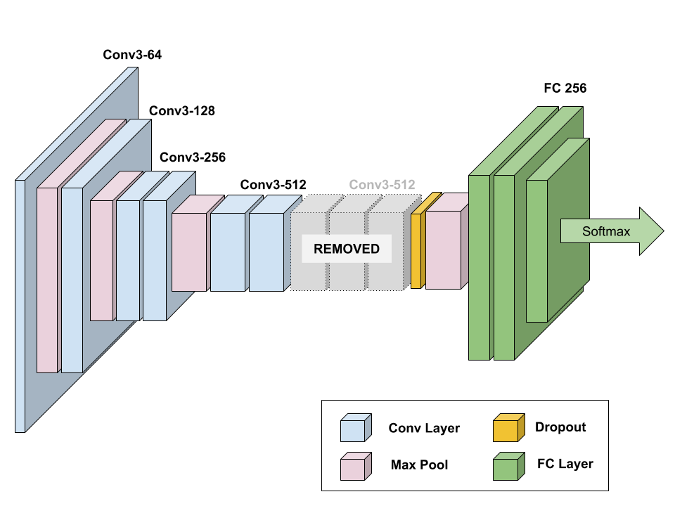
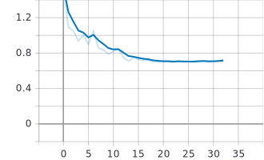

# OrcaDetector Final Project Report

This UC Berkeley Master of Information in Data Science final course project was developed by
[Spyros Garyfallos](mailto:spiros.garifallos@berkeley.edu ), [Ram Iyer](mailto:ram.iyer@berkeley.edu), and [Mike Winton](mailto:mwinton@berkeley.edu) for the W251 "Deep Learning in the Cloud and at the Edge" course (Summer 2019 term).

## Abstract

This paper applies the previously published [VGGish audio classification model](https://ai.google/research/pubs/pub45611) to classify the species of marine mammals based on audio samples.  We use a distant learning approach, beginning with model weights that were pretrained on Google's published [Audioset](https://research.google.com/audioset/) data.  We then finish training with a strongly supervised dataset from [Watkins Marine Mammal Sound Database](https://cis.whoi.edu/science/B/whalesounds/fullCuts.cfm).  We achieve an overall F1 score of 0.89 over 38 species, with 26 of the species achieving an F1 score >= 0.70.  We then deploy the trained model to an [NVIDIA Jetson TX2](https://www.nvidia.com/en-us/autonomous-machines/embedded-systems/jetson-tx2/) edge computing device to perform inference locally, simulating a deployment connected to a hydrophone in the middle of the ocean without internet connectivity.   Since we don't have access to our own hydrophone, for the purposes of simulation, we connect to the [live.orcasound.net](http://live.orcasound.net) live audio stream and perform inference on this stream.  We also incorporate the ability for a person to "inject" an audio sample from a marine mammal species into the live audio stream to simulate an actual detection event.

## Introduction - Spyros

- why are marine mammals interesting to scientists? 
- how would this model be useful to scientists?
- how is data collected, and why is the disconnected nature of a TX2-like device useful?

## Background - Ram

- how is audio classification generally done (audio -> image)?
- what is a mel spectrogram
- give a few different examples from the links we collected
- what kind of accuracy has been demonstrated in similar use cases?

## Current Contributions

Mel spectrograms are commonly used representations of audio signals, as they are more classifiable by deep learning models than the original audio waveforms.  They have been used as a feature representation in deep learning models for the classification of whale acoustic signals, and also for automated classification of bird species.  However, we believe our work is unique in that we simultaneously attempt to classify a large number of marine mammal species (38), generally with very good results.

We also have collected "noise" data from multiple live streaming hydrophones in order to create a supervised "Noise" training set, which is important in that it can be used in combination with the actual marine mammal training data to enable the model to predict when _none of the species_ are present in a given audio sample.  This is important for real-life applications, as we would generally expect a hydrophone to not be picking up marine mammal audio most of the time.

We also demonstrate that our model, once trained on a cloud virtual machine can then be deployed to a disconnected edge computing device for inference (the TX2).  When a positive prediction is made, we also capture the audio signal, which could enable further future analysis.

## Model Architecture

We used a model architecture named "[VGGish](https://github.com/tensorflow/models/tree/master/research/audioset/vggish)", developed by Google, along with pretrained weights trained on a subset of Google's AudioSet with 2 million human-labeled 10-second YouTube video clips, with labels taken from an ontology of more than 600 audio event classes.  This model gets its name from the fact that it's based on the common [VGG](https://arxiv.org/abs/1409.1556) architecture for image classification.

After instantiating the model with Google's pretrained weights, we apply a distant supervision approach by treating those weights as a "warm start" for a model with additional layers built on top of the original VGGish layers.  We also continue to update the weights in the core VGGish layers when we train on our supervised marine mammal training set.

Specifically VGGish is a variant of the 11 weight-layer version of VGG (model "A" in the original paper), with the following changes:

1. Input size was changed to 96x64 for consistency with log mel spectrogram inputs.
2. The last group of convolutional and max pool layers are dropped, leaving this model with only 4 groups instead of 5 in the original model. 
3. The final 1000-wide fully-connected layer is replaced with a 128-wide fully-connected layer.  (Note that the model we developed and trained does not incorporate this layer; we only use the pre-bottleneck layers of VGGish.)

On top of those base layers, we have added a dropout layer to provide some regularization before the final max pooling layer.  Then we add a series of two 256-wide fully-connected layers, and the final 38-class softmax layer.  Our complete model is shown below:

We use categorical cross-entropy as our loss function, and the ADAM optimizer.

## Method

Most of our development and model training was done on virtual machines with NVIDIA V100 GPUs.  Our choice to use Docker containers enabled us to use both IBM Virtual Servers (e.g. ACL2.8x60x100 instances with 8 VPUs, 1 V100 GPU w/ 16GB GPU memory, and 60 GB RAM) as well as AWS instances (e.g. p3.2xlarge instances with 8 VCPUs, 1 V100 GPU w/ 16GB GPU memory, 61 GB RAM).  Once we had trained weights, we deployed to NVIDIA Jetson TX2 developer boards.  We implement our model in Keras, bootstrapping with substantial code from [Google's VGGish repo](https://github.com/tensorflow/models/tree/master/research/audioset/vggish) and [DTaoo's Keras implementation](https://github.com/DTaoo/VGGish).

### Dataset - Spyros

- crawling the Watkins data (with permission)
- quantizing and converting to spectrograms
- stratified train/val/test split
- selected EDA plots
- choice of species what were included vs. excluded (based on too few training samples)
- collection of Noise data from live streams

### Mel Spectrogram Feature Computation

> NOTE: Spyros, feel free to incorporate this in your section if you want, rather than keeping as a separate section.  

We compute our audio features consistently with Google (using open source code provided in their [GitHub repo](https://github.com/tensorflow/models/tree/master/research/audioset/vggish)):

1. We resample all audio files (up or down-sampling as necessary) to 16 KHz.
2. We compute a spectrogram using magnitudes of a Short-Time Fourier Transform with 25 ms window size, 10 ms window hop, and a periodic Hann window.
3. We compute a mel spectrogram by mapping this spectrogram to 64 mel bins, covering 125-7500 Hz.
4. We calculate a stabilized log mel spectrogram as log(mel spectrogram + 0.01) in order to errors from log(0).
5. We quantize the spectrogram into non-overlapping segments of 0.96 seconds length, corresponding to 64 mel bands x 96 frames of 10 ms each.

Because the marine mammal audio samples we use for training the model are collected on different equipment in different locations over a span of many years, the recording conditions vary substantially.  As a result, we find it important to apply batch normalization to all data before feeding it in to our neural network.

### EDA - Ram

- pick interesting plots from the EDA notebook and insert here

### Experimental Results

We performed a series of hyperparameter optimization experiments varying the following parameters (details of key runs are in this [Google Sheet](https://docs.google.com/spreadsheets/d/1AInfJPV6c3MjMXjJ0WYBfp52MPZmGdZVDw-sr4wghvg/edit?usp=sharing)):

- Batch size: 64 - 256
- Dropout: 0 - 0.4
- Optimizer: Stochastic Gradient Descent, ADAM
- ADAM learning rate: 0.0001 - 0.005
- Final dense layers: None, 2 x 256-wide, 2 x 4096-wide
- L2 regularization: None, 0.005 - 0.1

Our final hyperparameter selection uses a batch size of 64 samples.  We specify 100 epochs of training, with an early stopping condition that typically results in training being completed in approximately 35 epochs. We use an ADAM optimizer, with initial learning rate of 0.001.  We also apply a Keras callback to reduce the learning rate when learning has plateaued for 2 consecutive epochs, with a minimum allowed learning rate of 0.00001.

We also apply a dropout of 0.4 after the core VGGish portion of the model, and we apply L2 regularization (lambda=0.01) for all convolutional and fully-connected layers.

Our best model achieved a training loss of 0.3782, a training accuracy of 0.9498; validation set loss of 0.5784, and validation set accuracy of 0.8884.   

Here is the validation accuracy for training of our best model:

Here is the corresponding loss plot for training of the best model:

Here we show the classification metrics for each species (note that "Support" indicates the number of samples in the test set):

You can observe that most of the species for which we observed low F1 scores in the test set have a relatively small number of samples (see the "Support" column above).  Only the Short Finned Pacific Pilot Whale has a sufficiently large number of samples but still is hard to classify.  It shows high precision, but poor recall.  Further research would be needed in order to better understand why this species is hard to classify.

## Live Stream Inference - Spyros

- describe architecture of handling live stream
- injection, ffmpeg mixing

## Simulation - Ram

- how Flash web app (or Jupyter notebook) works
- include link to the notebook here

## Conclusion - Mike

- impressive results, with model that easily fits on a TX2
- demonstrated that VGGish works well for marine mammal classification
- demonstrated that distant learning w/ Audioset YouTube samples (millions) followed by strongly supervised topical samples (thousands of audio files)
- room for future improvements depending on which species are most interesting

## Future Work - Spyros

- generate augmented training dataset by using our simulation technique to generate "blurred" audio files by mixing different levels of noice with the mammal sounds.
- more work on the few poorly classified species
- run the live stream inference for a few weeks to see if we detect any species organically
- visualization

## References

- [CNN Architectures for Large-Scale Audio Classification](https://ai.google/research/pubs/pub45611)
- [Audio Set: An ontology and human-labeled dataset for audio events](https://ai.google/research/pubs/pub45857)
- [Very Deep Convolutional Networks for Large-Scale Image Recognition](https://arxiv.org/abs/1409.1556)
- [Fusing Shallow and Deep Learning for Bioacoustic Bird Species Classification](https://par.nsf.gov/servlets/purl/10042567)
- [Detection and Classification of Whale Acoustic Signals](https://pdfs.semanticscholar.org/7707/161301fa094c379a87383dd05058e32fe5cc.pdf)
- [Audio features for web-based ML](https://smus.com/web-audio-ml-features/)
- [Urban Sound Classification using Convolutional Neural Networks with Keras: Theory and Implementation](https://medium.com/gradientcrescent/urban-sound-classification-using-convolutional-neural-networks-with-keras-theory-and-486e92785df4)
- [Audio Classification with Pre-trained VGG-19 (Keras)](https://towardsdatascience.com/audio-classification-with-pre-trained-vgg-19-keras-bca55c2a0efe)
- [BirdNET: the Easiest Way To Identify Birds By Sound](https://birdnet.cornell.edu/)
- [Building a Dead Simple Speech Recognition Engine using ConvNet in Keras](https://blog.manash.me/building-a-dead-simple-word-recognition-engine-using-convnet-in-keras-25e72c19c12b?gi=8dc01998d177)
- [Sound Classification with TensorFlow](https://medium.com/iotforall/sound-classification-with-tensorflow-8209bdb03dfb)
