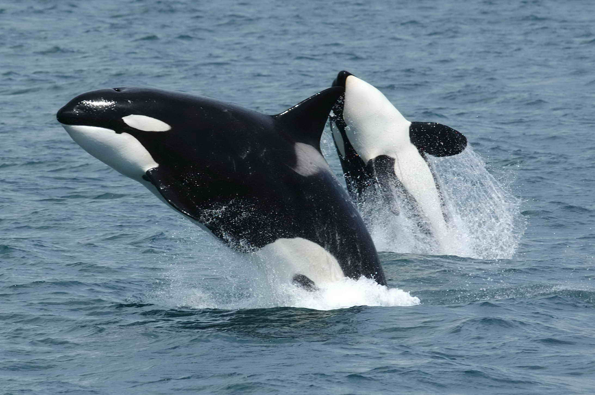
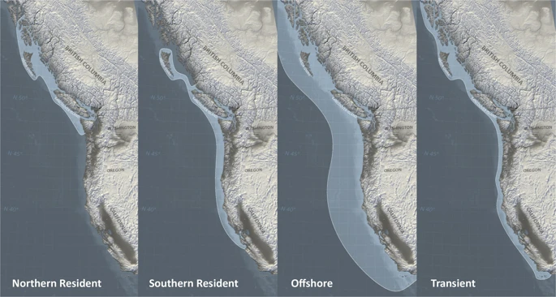
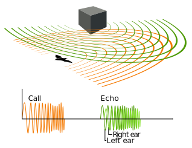
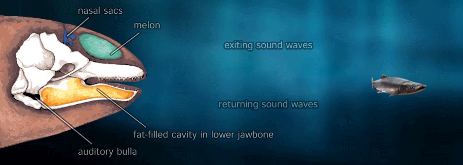
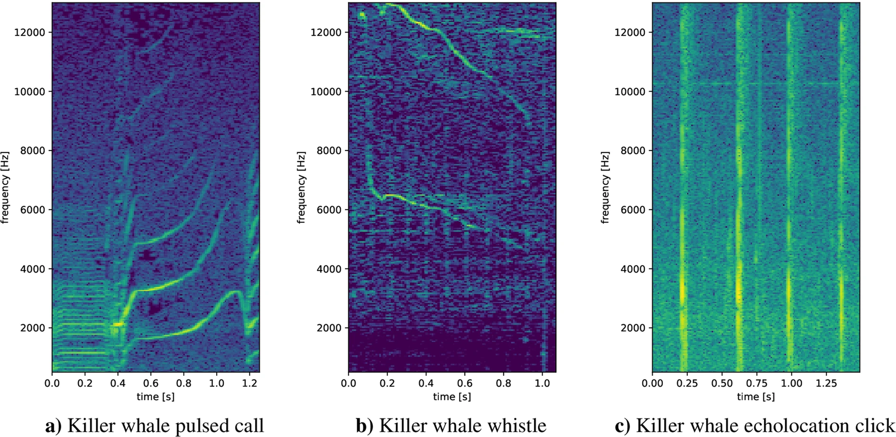
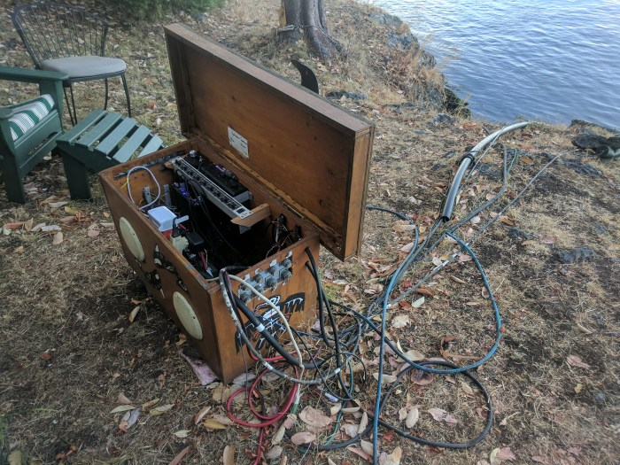
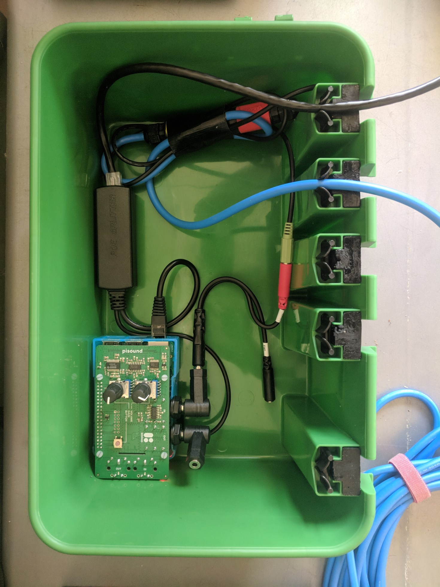
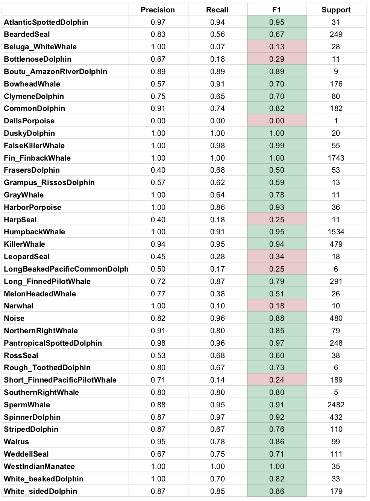
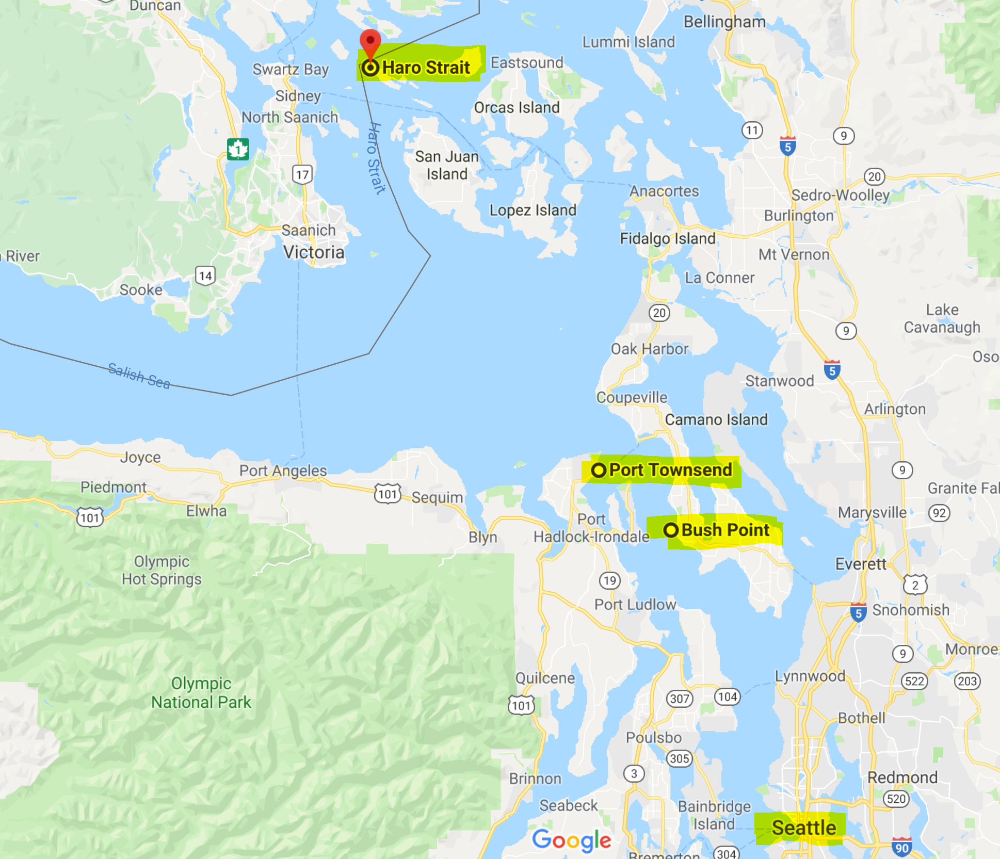

# OrcaDetector Final Project Report

This UC Berkeley Master of Information in Data Science final course project was developed by
[Spyros Garyfallos](mailto:spiros.garifallos@berkeley.edu ), [Ram Iyer](mailto:ram.iyer@berkeley.edu), and [Mike Winton](mailto:mwinton@berkeley.edu) for the W251 "Deep Learning in the Cloud and at the Edge" course (Summer 2019 term).

## Abstract

This paper applies the previously published [VGGish audio classification model](https://ai.google/research/pubs/pub45611) to classify the species of marine mammals based on audio samples.  We use a distant learning approach, beginning with model weights that were pretrained on Google's published [Audioset](https://research.google.com/audioset/) data.  We then finish training with a strongly supervised dataset from [Watkins Marine Mammal Sound Database](https://cis.whoi.edu/science/B/whalesounds/fullCuts.cfm).  We achieve an overall F1 score of 0.89 over 38 species, with 26 of the species achieving an F1 score >= 0.70.  We then deploy the trained model to an [NVIDIA Jetson TX2](https://www.nvidia.com/en-us/autonomous-machines/embedded-systems/jetson-tx2/) edge computing device to perform inference locally, simulating a deployment connected to a hydrophone in the middle of the ocean without internet connectivity.   Since we don't have access to our own hydrophone, for the purposes of simulation, we connect to the [live.orcasound.net](http://live.orcasound.net) live audio stream and perform inference on this stream.  We also incorporate the ability for a person to "inject" an audio sample from a marine mammal species into the live audio stream to simulate an actual detection event.

## Introduction

### Marine Mammals

Marine mammals are aquatic mammals that rely on the ocean and other marine ecosystems for their existence. They include animals such as seals, whales, manatees, sea otters and polar bears. They do not represent a distinct taxon or systematic grouping, but rather have a polyphyletic relation due to convergent evolution, as in they do not have an immediate common ancestor. They are also unified by their reliance on the marine environment for feeding.

### Killer Whale

Source:[Wikipedia](https://en.wikipedia.org/wiki/Killer_whale)

The killer whale or orca (Orcinus orca) is a toothed whale belonging to the oceanic dolphin family, of which it is the largest member. Killer whales have a diverse diet, although individual populations often specialize in particular types of prey. Some feed exclusively on fish, while others hunt marine mammals such as seals and other species of dolphin. They have been known to attack baleen whale calves, and even adult whales. Killer whales are apex predators, as no animal preys on them. A cosmopolitan species, they can be found in each of the world's oceans in a variety of marine environments, from Arctic and Antarctic regions to tropical seas, absent only from the Baltic and Black seas, and some areas of the Arctic Ocean.

### Killer Whale Types

Research off the west coast of Canada and the United States in the 1970s and 1980s identified the following three types:

Source: [Scientific Reports](https://www.nature.com/articles/s41598-019-47335-w)

1. **Resident**: These are the most commonly sighted of the three populations in the coastal waters of the northeast Pacific.

1. **Transient**: The diets of these whales consist almost exclusively of marine mammals.

1. **Offshore**: A third population of killer whales in the northeast Pacific was discovered in 1988, when a humpback whale researcher observed them in open water.

> Transients and residents live in the same areas, but avoid each other

### Echolocation

Source:[Wikipedia](https://en.wikipedia.org/wiki/Animal_echolocation)

Sound waves travel through water at a speed of about 1.5 km/sec (0.9 mi/sec), which is 4.5 times as fast as sound traveling through air. Marine mammals have developed adaptations to ensure effective communication, prey capture, and predator detection. The most notable adaptation is the development of echolocation in whales and dolphins.

Killer whales probably rely on sound production and reception to navigate, communicate, and hunt in dark or murky waters. Under these conditions, sight is of little use.

Source:[Wikipedia](https://en.wikipedia.org/wiki/Animal_echolocation)

Toothed whales emit a focused beam of high-frequency clicks in the direction that their head is pointing. Sounds are generated by passing air from the bony nares through the phonic lips. These sounds are reflected by the dense concave bone of the cranium and an air sac at its base. The focused beam is modulated by a large fatty organ known as the 'melon'. This acts like an acoustic lens because it is composed of lipids of differing densities.

### Communication

Killer whales use whistles for close-range, or private, communication and coordination of behavioral interactions between animals. Whistles are high pitched, show a high degree of directionality and are highly modulated, as a result, they don't carry far underwater.

The frequency of killer whale whistles ranges from about 0.5 to 40 kHz, with peak energy at 6 to 12 kHz. Studying northern resident killer whales, researchers found that the whales produced more whistles when they were close to other individuals and only sporadically emitted them when the whales were dispersed over larger areas.
Transient killer whales also use whistles, but more sparingly and have a smaller repertoire in comparison to residents.

Source:[Communication & Echolocation](https://seaworld.org/animals/all-about/killer-whale/communication/)

Pulsed calls are the most common vocalization of killer whales.

Experts think these calls function in group recognition and coordination of behavior. Killer whales make these calls at frequencies of about 0.5 to 25 kHz, with peak energy at 1 to 6 kHz. Calls that sound the same time after time are called **stereotyped calls**. All a killer whale's stereotyped calls make up that whale's repertoire.

### Killer Whale Dialects

The individuals of any particular pod share the same repertoire of calls, a vocalization system called a dialect.

Although scientists have noted that there is some type of structure to the calls, a dialect is not the same thing as a language. Analysis of killer whale call patterns has demonstrated substantial **differences between the dialects of different pods**. Pods that associate with one another may share certain calls. Pods that share calls are called a clan.
Pods may share a certain level of their repertoire with other pods while other portions are unique. The more similarities they share may indicate the degree the pods and individuals are related.

>**No two pods share the entire repertoire**

Each pod has its own unique dialect. In fact, the vocal repertoires of each pod remain distinct enough that scientists can identify pods by the sounds they make.
Killer whales that are separated by great geographical distances have completely different dialects. An analysis of Icelandic and Norwegian killer whale pods revealed that the Icelandic population made 24 different calls and the Norwegian whales made 23 different calls, but the two populations did not share any of the same calls.

### Audio samples

There are multiple samples online of different Killer Whale sounds. Here, we've assembled a few of them that we think are interesting:

1. [Resident calls](http://www.marinemammal.org//wp-content/uploads/2012/10/Resident_calls1.wav)

1. [Transient whistles](http://www.marinemammal.org//wp-content/uploads/2012/10/Transient_whistles2.wav)

1. [Transient calls](http://www.marinemammal.org//wp-content/uploads/2012/10/Transient_calls.wav)

1. [Transient echolocation](http://www.marinemammal.org//wp-content/uploads/2012/10/Transient_echolocation1.wav)

### Echolocation samples slowed down

Here, we can hear the clicks echoing back on underwater surfaces by slowing down the audio speed by a factor of 10x.

1. [South Residents Killer Whale clicks normal speed](https://www.orcasound.net/data/processed/SRKW/orcasite/srkw-clicks-slow.mp3)

1. [South Residents Killer Whale clicks slowed down 10x](https://www.orcasound.net/data/processed/SRKW/orcasite/srkw-clicks-slowed10x.mp3)

### Social Structure

Killer whales are notable for their complex societies. Only elephants and higher primates live in comparably complex social structures.Due to orcas' complex social bonds, many marine experts have concerns about how humane it is to keep them in captivity.

Resident killer whales in the eastern North Pacific live in particularly complex and stable social groups. Unlike any other known mammal social structure, resident whales live with their mothers for their entire lives. These family groups are based on matrilines consisting of the eldest female (matriarch) and her sons and daughters, and the descendants of her daughters, etc. The average size of a matriline is 5.5 animals. Because females can reach age 90, as many as four generations travel together. These matrilineal groups are highly stable. Individuals separate for only a few hours at a time, to mate or forage. With one exception, a killer whale named Luna, no permanent separation of an individual from a resident matriline has been recorded.

### Conservation

In 2008, the IUCN (International Union for Conservation of Nature) changed its assessment of the killer whale's conservation status from conservation dependent to data deficient, recognizing that one or more killer whale types may actually be separate, endangered species. Depletion of prey species, pollution, large-scale oil spills, and habitat disturbance caused by noise and conflicts with boats are the most significant worldwide threats.

In the Pacific Northwest, wild salmon stocks, a main resident food source, have declined dramatically in recent years. In the Puget Sound region **only 75 whales remain** with few births over the last few years.

### Underwater noise

Underwater noise from shipping, drilling, and other human activities is a significant concern in some key killer whale habitats, including Johnstone Strait and Haro Strait. In the mid-1990s, loud underwater noises from salmon farms were used to deter seals. Killer whales also avoided the surrounding waters.High-intensity sonar used by the Navy disturbs killer whales along with other marine mammals.Killer whales are popular with whale watchers, which may stress the whales and alter their behaviour, particularly if boats approach too closely or block their lines of travel.

### OrcaSound Lab

Centered within the summertime habitat of the endangered southern resident killer whales, Orcasound Lab is also a good place to listen for ships passing through Haro Strait and boats traveling along the west side of San Juan Island. In the fall you can hear humpbacks, and in the summer male harbor seals vocalize nearby. The hydrophones were first deployed in 2002 are currently just beyond the kelp about 30 m offshore at a depth of 8m. Orcasound Lab is hosted by Beam Reach, a social purpose corporation based in Seattle.

### OrcaSound Lab Hydrophones

Source: [OrcaSound](https://www.orcasound.net/portfolio/orcasound-lab-hydrophone/)

Orcasound Lab is also the home and laboratory of Dr. Val Veirs who first deployed hydrophones there in the early 2000s with physics and environmental science students from Colorado College. The node has hosted an array of 4-8 hydrophones stretched ~200m along shore at depths of 5-20 meters. Since then, there have been multiple hydrophone deployments, repairs, and acoustic research projects conducted at the node.

Source: [OrcaSound](https://www.orcasound.net/2018/04/27/orcasounds-new-live-audio-solution-from-hydrophone-to-headphone-with-a-raspberry-pi-computer-and-hls-dash-streaming-software/)

The latest Orcasound 2.0 prototype: A hydrophone cable (blue) connects to the input of the Pisound sound board which is attached to a Raspberry Pi3 which is powered over the ethernet cable (black) that also allows open-source software, including ffmpeg and s3fs, to transfer live audio data to an S3 bucket hosted by Amazon Web Services! It’s all kept safe in an inexpensive, easy to set-up waterproof box, plus there’s room for a second hydrophone, an optional external speaker.

### Orca Sound Detectors

In the past decade, various researchers have used traditional signal processing and speech recognition techniques, such as dynamic time warping, hidden Markov and Gaussian mixture models as well as spectrogram correlation to develop algorithms in order to detect dolphin, bowhead whale, elephant, bird, and killer whale vocalizations. Others have adopted techniques like discriminant function analysis random forest classifiers decision tree classification systems, template-based automatic recognition, artificial neural networks, and support vector machines in conjunction with (handcrafted) temporal and/or spectral features (e.g. mel-frequency cepstrum coefficients) for bat, primate, bird, and killer whale sound detection/classification. Many of the aforementioned research works used much smaller datasets, both for training and evaluation. In addition, for many of those traditional machine-learning techniques, a set of acoustic (handcrafted) features or parameters needed to be manually chosen and adjusted for the comparison of similar bioacoustic signals.

However, features derived from small data corpora usually do not reflect the entire spread of signal varieties and characteristics. Moreover, traditional machine-learning algorithms often perform worse than modern deep learning approaches, especially if the dataset contains a comprehensive amount of (labeled) data. Due to insufficient feature qualities, small training/validation data, and the traditional machine-learning algorithms themselves, model robustness and the ability to generalize suffer greatly while analyzing large, noise-heavy, and real-world (unseen) data corpora containing a variety of distinct signal characteristics. Furthermore, traditional machine-learning and feature engineering algorithms have problems in efficiently processing and modelling the complexity and non-linearity of large datasets. Outside the bioacoustic field, deep neural network (DNN) methods have progressed tremendously because of the accessibility to large training data and increasing computational power by the use of graphics processing units (GPUs). DNNs have not only performed well in computer vision but also outperformed traditional methods in speech recognition as evaluated in several benchmark studies. Such recent successes of DNNs inspired the bioacoustic community to apply state-of-the-art methods on animal sound detection and classification.

### Detection status today

In the research community There is a tremendous interest for an accurate automated Orca Sound detector. Although many attempts have been made to create one, today most of the detections are made by people listening to the audio, live or recorded, either experts or self-taught community enthusiasts.

### Real time detectors

The primary value for a real time accurate detector is to produce a timely waring to the vessels in the proximity of the detection to reduce speed or pause extreme activities like submarine military sonar exercises, to protect the Whales and offer a safe passage.

Furthermore, an accurate detection mechanism will allow the marine scientists to collect more samples and better understand these species.

### Detection on the Edge

Researchers indicate that an audio spectrum up to 160 kHz will reveal new information from these species sounds that has not been yet studied. The required upstream bandwidth and cost for such hydrophones though is forbidding. This can be solved by an automated detector running on the edge and uploading only the sparse positive samples.

## Background - Ram

- how is audio classification generally done (audio -> image)?
- what is a mel spectrogram
- give a few different examples from the links we collected
- what kind of accuracy has been demonstrated in similar use cases?

## Current Contributions

Mel spectrograms are commonly used representations of audio signals, as they are more classifiable by deep learning models than the original audio waveforms.  They have been used as a feature representation in deep learning models for the classification of whale acoustic signals, and also for automated classification of bird species.  However, we believe our work is unique in that we simultaneously attempt to classify a large number of marine mammal species (38), generally with very good results.

We also have collected "noise" data from multiple live streaming hydrophones in order to create a supervised "Noise" training set, which is important in that it can be used in combination with the actual marine mammal training data to enable the model to predict when _none of the species_ are present in a given audio sample.  This is important for real-life applications, as we would generally expect a hydrophone to not be picking up marine mammal audio most of the time.

We also demonstrate that our model, once trained on a cloud virtual machine can then be deployed to a disconnected edge computing device for inference (the TX2).  When a positive prediction is made, we also capture the audio signal, which could enable further future analysis.

## Model Architecture

We used a model architecture named "[VGGish](https://github.com/tensorflow/models/tree/master/research/audioset/vggish)", developed by Google, along with pretrained weights trained on a subset of Google's AudioSet with 2 million human-labeled 10-second YouTube video clips, with labels taken from an ontology of more than 600 audio event classes.  This model gets its name from the fact that it's based on the common [VGG](https://arxiv.org/abs/1409.1556) architecture for image classification.

After instantiating the model with Google's pretrained weights, we apply a distant supervision approach by treating those weights as a "warm start" for a model with additional layers built on top of the original VGGish layers.  We also continue to update the weights in the core VGGish layers when we train on our supervised marine mammal training set.

Specifically VGGish is a variant of the 11 weight-layer version of VGG (model "A" in the original paper), with the following changes:

1. Input size was changed to 96x64 for consistency with log mel spectrogram inputs.
2. The last group of convolutional and max pool layers are dropped, leaving this model with only 4 groups instead of 5 in the original model.
3. The final 1000-wide fully-connected layer is replaced with a 128-wide fully-connected layer.  (Note that the model we developed and trained does not incorporate this layer; we only use the pre-bottleneck layers of VGGish.)

On top of those base layers, we have added a dropout layer to provide some regularization before the final max pooling layer.  Then we add a series of two 256-wide fully-connected layers, and the final 38-class softmax layer.  Our complete model is shown below:

We use categorical cross-entropy as our loss function, and the ADAM optimizer.

## Method

Most of our development and model training was done on virtual machines with NVIDIA V100 GPUs.  Our choice to use Docker containers enabled us to use both IBM Virtual Servers (e.g. ACL2.8x60x100 instances with 8 VPUs, 1 V100 GPU w/ 16GB GPU memory, and 60 GB RAM) as well as AWS instances (e.g. p3.2xlarge instances with 8 VCPUs, 1 V100 GPU w/ 16GB GPU memory, 61 GB RAM).  Once we had trained weights, we deployed to NVIDIA Jetson TX2 developer boards.  We implement our model in Keras, bootstrapping with substantial code from [Google's VGGish repo](https://github.com/tensorflow/models/tree/master/research/audioset/vggish) and [DTaoo's Keras implementation](https://github.com/DTaoo/VGGish).

### Dataset

To train a multi-class DNN we used the [Watkins Marine Mammal Sound Database](https://cis.whoi.edu/science/B/whalesounds/index.cfm). We contacted the Watkins scientific team and got  the permission to crawl their online database.

#### Web Scrapping

Furthermore, the team sent us a web crawling prototype implementedPython to facilitate our efforts. A modified version of it is committed in this repo. The crawled dataset consisted of ~20GB of labeled WAV files of 56 different marine mammals. These samples have been collected from different locations and years.

> We've excluded all species from the dataset that had less than 10 samples.

#### Mel Spectrogram Feature Computation

We compute our audio features consistently with Google (using open source code provided in their [GitHub repo](https://github.com/tensorflow/models/tree/master/research/audioset/vggish)):

1. We resample all audio files (up or down-sampling as necessary) to 16 KHz.
2. We compute a spectrogram using magnitudes of a Short-Time Fourier Transform with 25 ms window size, 10 ms window hop, and a periodic Hann window.
3. We compute a mel spectrogram by mapping this spectrogram to 64 mel bins, covering 125-7500 Hz.
4. We calculate a stabilized log mel spectrogram as log(mel spectrogram + 0.01) in order to errors from log(0).
5. We quantize the spectrogram into non-overlapping segments of 0.96 seconds length, corresponding to 64 mel bands x 96 frames of 10 ms each.

Because the marine mammal audio samples we use for training the model are collected on different equipment in different locations over a span of many years, the recording conditions vary substantially.  As a result, we find it important to apply batch normalization to all data before feeding it in to our neural network.

#### Background Noise Class

To allow the network to detect a negative class (no species detected) we collected and added in the dataset a new class that represented the hydrophone background noise. To do this, we created a noise collection command that run for the duration of a weekend and periodically collected background noise samples from the OrcaSound live feed hydrophones, to make sure that we had a plethora of recorded different background noise phenomena (different ships, speed boats, waves, weather etc.).

#### Data stratification

We stratified the remaining samples in three statas:

1. 70% for the training strata
2. 20% for the validation strata
3. 10% for the test strata

### EDA - Ram

- link to the EDA notebook from the opening paragraph
- histogram of species distribution preferably by number of seconds of audio, but if that's too hard, by number of audio files (which you already have)
- state that the Sperm Whale is the predominant species (right?)
- sample waveform audio and corresponding mel spectrograms (at least Killer Whale and Sperm Whale since it dominates)
- other interesting plots from the EDA notebook and insert here

#### Modeled species
 
Based on the number of samples in the training dataset, our final model includes the following species:

- Atlantic Spotted Dolphin
- Bearded Seal
- Beluga White Whale
- Bottlenose Dolphin
- Boutu Amazon River Dolphin
- Bowhead Whale
- Clymene Dolphin
- Common Dolphin
- Dall's Porpoise
- Dusky Dolphin
- False Killer Whale
- Fin Finback Whale
- Frasers Dolphin
- Grampus Risso's Dolphin
- Gray Whale
- Harbor Porpoise
- Harp Seal
- Humpback Whale
- Killer Whale
- Leopard Seal
- Long Beaked Pacific Common Dolphin
- Long Finned Pilot Whale
- Melon Headed Whale
- Narwhal
- Noise
- Northern Right Whale
- Pantropical Spotted Dolphin
- Ross Seal
- Rough Toothed Dolphin
- Short Finned Pacific Pilot Whale
- Southern Right Whale
- Sperm Whale
- Spinner Dolphin
- Striped Dolphin
- Walrus
- Weddell Seal
- West Indian Manatee
- White Baked Dolphin
- White Sided Dolphin

The model excludes the following:

- Blue Whale
- Commerson's Dolphin
- Finless Porpoise
- Gray Seal
- Harbour Seal
- Heaviside's Dolphin
- Hooded Seal
- Irvaddy Dolphin
- Juan Fernandez Fur Seal
- Minke Whale
- New Zealand Fur Seal
- Ribbon Seal
- Ringed Seal
- Sea Otter
- Spotted Seal
- Steller Sea Lion
- Tucuxi Dolphin

### Experimental Results

We performed a series of hyperparameter optimization experiments varying the following parameters (details of key runs are in this [Google Sheet](https://docs.google.com/spreadsheets/d/1AInfJPV6c3MjMXjJ0WYBfp52MPZmGdZVDw-sr4wghvg/edit?usp=sharing)):

- Batch size: 64 - 256
- Dropout: 0 - 0.4
- Optimizer: Stochastic Gradient Descent, ADAM
- ADAM learning rate: 0.0001 - 0.005
- Final dense layers: None, 2 x 256-wide, 2 x 4096-wide
- L2 regularization: None, 0.005 - 0.1

Our final hyperparameter selection uses a batch size of 64 samples.  We specify 100 epochs of training, with an early stopping condition that typically results in training being completed in approximately 35 epochs. We use an ADAM optimizer, with initial learning rate of 0.001.  We also apply a Keras callback to reduce the learning rate when learning has plateaued for 2 consecutive epochs, with a minimum allowed learning rate of 0.00001.

We also apply a dropout of 0.4 after the core VGGish portion of the model, and we apply L2 regularization (lambda=0.01) for all convolutional and fully-connected layers.

Our best model achieved a training loss of 0.3782, a training accuracy of 0.9498; validation set loss of 0.5784, and validation set accuracy of 0.8884.

Here is the validation accuracy for training of our best model:

Here is the corresponding loss plot for training of the best model:

Here we show the classification metrics for each species (note that "Support" indicates the number of samples in the test set):

You can observe that most of the species for which we observed low F1 scores in the test set have a relatively small number of samples (see the "Support" column above).  Only the Short Finned Pacific Pilot Whale has a sufficiently large number of samples but still is hard to classify.  It shows high precision, but poor recall.  Further research would be needed in order to better understand why this species is hard to classify.

## Live Stream Inference

After training and testing the network, the next step was real input testing. Of course, this posed two problems:

1. We didn't have a hydrophone, water proof equipment and site with electricity and network coverage to run our model
2. Orca Whales vocalizations nowadays are very rare in the ‎Salish Sea (Seattle greater area)

To mitigate the first problem, we used the live web audio hydrophone sources from [live.orcasound.net](http://live.orcasound.net). There are currently three active hydrophones in the Salish sea, one at the **Port Townsend**, one at the **Bush Point** and finally one at the **Haro Strait**

These live hydrophone sources are broadcasted online using the [HTTP Live Streaming](https://en.wikipedia.org/wiki/HTTP_Live_Streaming) protocol. The live inference program will connect to the configured live streaming endpoints and will collect ten seconds of each stream, in one second segments. Then, after extracting the audio features the same way the features were extracted in the training phase, a batch inference is performed in Keras. If a positive detection is found with a confidence above the minimum threshold (>75%), then a backup of the audio samples is kept along with the inference results in a json file.

To mitigate the Orcas vocalization sparsity, we added to the inference program an ad-hoc mixing capability that injected a predefined Orca sound into the live hydrophones stream. We found this approach very useful as a testing pipeline that validates a positive detection inference on a known positive sample, and conversely, a negative detection on noise samples. This approach can be very useful in continuous delivery pipelines of newly trained networks, especially for Edge scenarios.

## Simulation - Ram

- how Flash web app (or Jupyter notebook) works
- include link to the notebook here

## Conclusion - Mike

- impressive results, with model that easily fits on a TX2
- demonstrated that VGGish works well for marine mammal classification
- demonstrated that distant learning w/ Audioset YouTube samples (millions) followed by strongly supervised topical samples (thousands of audio files)
- room for future improvements depending on which species are most interesting

## Future Work

After talking to some marine mammals experts in the scientific community, there are some very valuable low-hanging-fruits as next steps that can put this work into use and provide another tool to the community that will help protect and study these species:

- Move the inference on the existing hydrophones (on the Edge). As we saw, the current hydrophones run on a Raspberry Pi 3. Moving the inference on this device, perhaps by using [an Edge TPU acceleration](https://coral.withgoogle.com/products/accelerator/), we can allow the collection of high sapling lossless audio samples of Orcas by uploading only the detection segments. Also, with will allow the disconnected hydrophones scenarios that will record the detections on a limited size memory chip.
- Augment our training dataset by mixing noise with the existing positive samples at various levels (analogous to augmenting image training data by adding blur)
- Improve the live inference sampling method to reduce the 10 seconds sampling window and get closer to zero latency inference.
- Define a manual validation web interface that allows the experts to see and validate or correct the trained network and increase the quality of the detections.
- Create location specific training datasets that include samples of a single pod dialect and ambient noise.
- Implement a continuous learning pipeline that incorporates the new detections in the training dataset to increase the network accuracy.
- Expand the dataset to more species and collect more data for the species for which data is currently sparse.  Notably we currently have insufficient data to classify most seal species effectively.
- Try downsampling the predominant species (Sperm Whale) during training so that its frequency in the dataset is more similar to other species
- Implement a detection notification mechanism to inform the community for the real time detection.
- Use the signal from multiple hydrophones to triangulate the location of a pod.
- Use autonomous drones for aerial visual validation of a pod

## References

- [Marine mammal](https://en.wikipedia.org/wiki/Marine_mammal)
- [Killer Whales Communication and Echolocation](https://seaworld.org/animals/all-about/killer-whale/communication/)
- [Animal echolocation](https://en.wikipedia.org/wiki/Animal_echolocation)
- [Killer Whale](https://en.wikipedia.org/wiki/Killer_whale)
- [An Automatic Killer Whale Sound Detection Toolkit Using Deep Learning](https://www.nature.com/articles/s41598-019-47335-w/figures/1)
- [OrcaSound](https://www.orcasound.net/)
- [OrcaSound Hydrophone 2.0](https://www.orcasound.net/2018/04/27/orcasounds-new-live-audio-solution-from-hydrophone-to-headphone-with-a-raspberry-pi-computer-and-hls-dash-streaming-software/)
- [CNN Architectures for Large-Scale Audio Classification](https://ai.google/research/pubs/pub45611)
- [Audio Set: An ontology and human-labeled dataset for audio events](https://ai.google/research/pubs/pub45857)
- [Very Deep Convolutional Networks for Large-Scale Image Recognition](https://arxiv.org/abs/1409.1556)
- [Fusing Shallow and Deep Learning for Bioacoustic Bird Species Classification](https://par.nsf.gov/servlets/purl/10042567)
- [Detection and Classification of Whale Acoustic Signals](https://pdfs.semanticscholar.org/7707/161301fa094c379a87383dd05058e32fe5cc.pdf)
- [Audio features for web-based ML](https://smus.com/web-audio-ml-features/)
- [Urban Sound Classification using Convolutional Neural Networks with Keras: Theory and Implementation](https://medium.com/gradientcrescent/urban-sound-classification-using-convolutional-neural-networks-with-keras-theory-and-486e92785df4)
- [Audio Classification with Pre-trained VGG-19 (Keras)](https://towardsdatascience.com/audio-classification-with-pre-trained-vgg-19-keras-bca55c2a0efe)
- [BirdNET: the Easiest Way To Identify Birds By Sound](https://birdnet.cornell.edu/)
- [Building a Dead Simple Speech Recognition Engine using ConvNet in Keras](https://blog.manash.me/building-a-dead-simple-word-recognition-engine-using-convnet-in-keras-25e72c19c12b?gi=8dc01998d177)
- [Sound Classification with TensorFlow](https://medium.com/iotforall/sound-classification-with-tensorflow-8209bdb03dfb)
